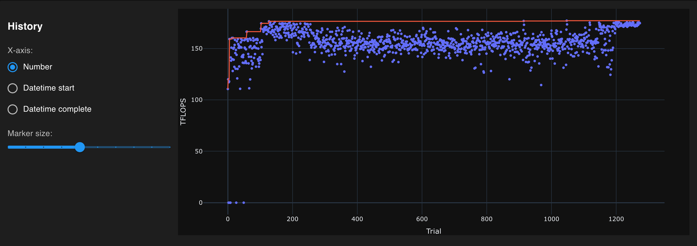
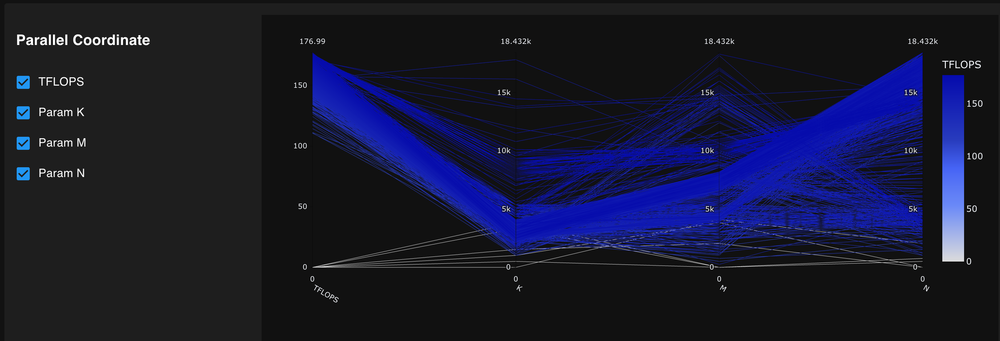

# testing theoretical max flops on gpus

Based on: [https://github.com/stas00/ml-engineering/tree/master/compute/accelerator#maximum-achievable-flops]

Original code here: [https://github.com/stas00/ml-engineering/blob/master/compute/accelerator/benchmarks/mamf-finder.py]

Original code does brute force search but we can do better with optuna, also we get a nice graph like:


or:


# Stats

| GPU Model | Best Shape (MxNxK) | TFLOPS |
|-----------|---------------------|--------|
| NVIDIA A100 SXM | 6912x16384x2048 | 267.9 |
| NVIDIA A100 PCIe | 2304x5120x1536 | 256.4 |
| NVIDIA H100 SXM | 6144x17920x2816 | 792.1 |
| NVIDIA RTX 4090 | 14336x4096x4096 | 178.4 |
| AMD MI300X | 4352x13568x3840 | 758.3 |


# Install

```
( if you are not using uv, install it: pip install uv)
git clone https://github.com/mag-/gpu_benchmark
uv venv
source .venv/bin/activate
uv pip install -r requirements.txt
./mamf-finder.py
```

# Changes:
- added optuna for finding the parameters instead of doing a brute-force search


# TODO:
- check raw Cuda
- check tinygrad
- add automatic posting of results to simple API

